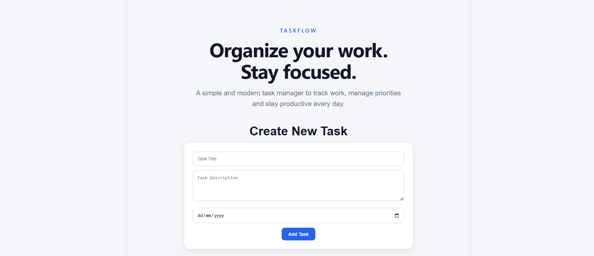
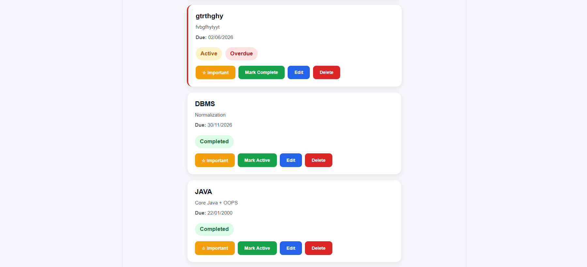

# 🚀 TaskFlow

### Modern Full-Stack Task Management Application

TaskFlow is a modern productivity-focused task management application built using React, Node.js, Express.js, and Local JSON-based Data Storage. It helps users organize tasks, manage priorities, track deadlines, and stay productive through a clean, responsive, and intuitive user experience.

---

## 🔗 Quick Links

* 🌐 **Live Demo:** https://personal-task-manager-blue.vercel.app
* 📂 **GitHub Repository:** https://github.com/Pratiyush-9/personal-task-manager
* ⚡ **Backend API:** https://personal-task-manager-7fbg.onrender.com/tasks

---

## 🎯 Project Highlights

* Full Stack Architecture
* RESTful API Integration
* Drag & Drop Task Reordering
* Due Date Tracking & Overdue Alerts
* Priority-Based Task Management
* Search & Filter Functionality
* Responsive Mobile-Friendly Design
* Persistent Task Storage
* Production Deployment Ready

---

## ✨ Features

### 📝 Task Management

* Create Tasks
* Edit Tasks
* Delete Tasks
* Mark Tasks as Completed
* Mark Tasks as Important
* Drag and Drop Task Reordering
* Persistent Task Storage

### 📅 Productivity Features

* Due Date Management
* Overdue Task Detection
* Task Prioritization
* Search Tasks Instantly
* Filter by Status
* Real-Time Statistics Dashboard
* Important Tasks Automatically Stay at Top
* Important Tasks Sorted by Due Date
* Persistent Task Ordering

### 🎨 User Experience

* Modern and Clean UI
* Fully Responsive Design
* Toast Notifications
* Delete Confirmation Dialogs
* Mobile-Friendly Interface
* Smooth Animations and Hover Effects

### ☁️ Data & Infrastructure

* JSON File Storage
* REST API Architecture
* Frontend & Backend Separation
* Production Deployment Support

---

## 🛠️ Tech Stack

### Frontend

* React.js
* Vite
* CSS3
* React Toastify
* SweetAlert2
* @hello-pangea/dnd

### Backend

* Node.js
* Express.js

### Data Storage

* JSON File Storage (`tasks.json`)

### Deployment

* Vercel (Frontend)
* Render (Backend)

---

## 📂 Project Structure

```text
TaskFlow

├── client
│   ├── src
│   │   ├── api
│   │   ├── App.jsx
│   │   └── App.css
│   │
│   └── public
│
├── server
│   ├── data
│   │   └── tasks.json
│   │
│   └── server.js
│
└── README.md
```

---

## ⚙️ Local Development Setup

### Clone Repository

```bash
git clone https://github.com/Pratiyush-9/personal-task-manager.git
cd personal-task-manager
```

### Backend Setup

```bash
cd server
npm install
npm start
```

Backend runs on:

```text
http://localhost:5000
```

### Frontend Setup

```bash
cd client
npm install
npm run dev
```

Frontend runs on:

```text
http://localhost:5173
```

---

## 🔌 API Endpoints

| Method | Endpoint             | Description             |
| ------ | -------------------- | ----------------------- |
| GET    | /tasks               | Fetch all tasks         |
| POST   | /tasks               | Create task             |
| PUT    | /tasks/:id           | Update task             |
| PATCH  | /tasks/:id/toggle    | Toggle task completion  |
| PATCH  | /tasks/:id/important | Toggle important status |
| PUT    | /tasks/reorder       | Reorder tasks           |
| DELETE | /tasks/:id           | Delete task             |

---

## 🚀 Deployment Architecture

```text
User
 ↓
Vercel Frontend
 ↓
Render Backend API
 ↓
JSON File Storage
```

---

## 🧠 Technical Challenges Solved

* Full CRUD Implementation
* Drag & Drop State Synchronization
* Persistent Task Ordering
* REST API Architecture
* Responsive UI Design
* Frontend & Backend Communication
* Important Task Prioritization
* Overdue Task Detection
* React State Management with Hooks

---

## 📈 Future Roadmap

### Phase 1

* JWT Authentication
* User Accounts
* User-Specific Task Storage

### Phase 2

* Dark Mode
* Categories & Tags
* Calendar View

### Phase 3

* Task Reminders
* Recurring Tasks
* Activity History

### Phase 4

* MongoDB Integration
* Cloud Database Storage

### Phase 5

* Team Collaboration
* Real-Time Updates
* Progressive Web App (PWA)

---

## 📸 Screenshots

### Dashboard


### Task Creation Form



### Task Management



---

## 🏆 Key Achievements

- Developed and deployed a full-stack task management application.
- Implemented CRUD operations using React and Express.js.
- Integrated drag-and-drop task reordering with persistent storage.
- Added task prioritization and overdue task detection.
- Deployed frontend on Vercel and backend on Render.
- Designed a responsive and user-friendly interface.

---

## 👨‍💻 Author

### Pratiyush Kumar

🔗 LinkedIn: https://www.linkedin.com/in/pratiyush-kumar-318435284/

